# android-mac-lab

10년 가까이 쓴 아이폰을 갤럭시 Z 폴드8로 바꾼 뒤, 맥북과 폰 사이의 연동을 직접 만들어 온 기록과 프로젝트 목록입니다.

> **English** — A hub for the small apps and tools I built in about a week (Sep 20–28, 2026) after switching from ten years of iPhone to a Galaxy Z Fold8.
> Each project rebuilds one piece of what the iPhone–Mac ecosystem used to give me (clipboard, file drop, mirroring, second display, camera and mic), or adds something the iPhone never had, all over Tailscale and wireless adb.
> Everything was built from the terminal with Claude Code, no Android Studio. The project list below is generated from `projects.json`.

동작 확인: Galaxy Z Fold8 (Android 17) · macOS 26

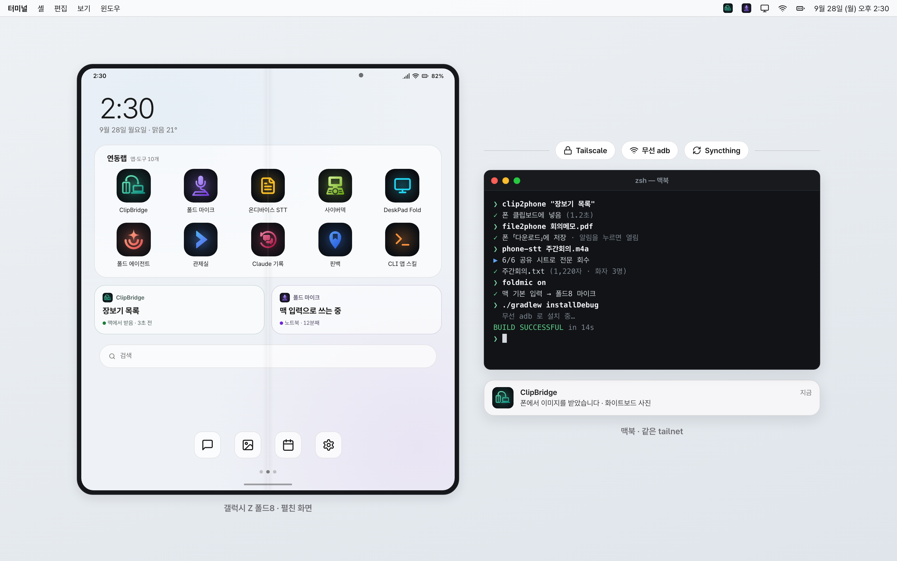
화면은 설명용 목업입니다.

<!-- VIDEO -->

이 저장소는 추커톤(AI & Beyond 추석 해커톤 2026) 출품작입니다.

## 왜 만들었나

저는 10년 가까이 아이폰을 썼고, 2026년 9월에 갤럭시 Z 폴드8로 바꿨습니다. 폰은 마음에 들었지만 맥북 옆에 두니 빈자리가 바로 보였습니다. 맥에서 복사한 걸 폰에 붙이는 일, 사진 한 장 넘기는 일, 폰을 맥의 보조 화면이나 카메라로 쓰는 일은 아이폰에서는 설정할 필요도 없었습니다.

기성 앱을 찾아 조합할 수도 있었지만, 먼저 확인하고 싶은 게 있었습니다. 「안드로이드는 앱을 직접 만들어 바로 깔 수 있다」는 말이 정말인지였습니다. 첫날 Android Studio 없이 JDK도 없던 맥에서 터미널만으로 앱을 빌드해 케이블 없이 폰에 설치하는 데 35분쯤 걸렸습니다. 그 뒤로는 아쉬운 게 생길 때마다 필요한 만큼만 만들었습니다.

그래서 이 랩의 목표는 하나입니다. **아이폰 생태계가 주던 것을 직접 만든다.** 만들다 보니 아이폰에는 없던 것(폰에서 맥 화면 조작, 폰에서 도는 에이전트, 맥의 Claude Code 세션 관제)도 생겼습니다.

- 전부 **무선**을 전제로 합니다. 폰과 맥은 Tailscale로 묶여 있고, 케이블은 처음 한 번 `adb tcpip` 할 때 말고는 쓰지 않습니다.
- 개발은 9월 20일부터 28일까지 약 일주일, Claude Code와 함께 했습니다. 방향과 판단은 제가 하고, 코드와 실기 검증은 대부분 Claude Code가 adb로 했습니다.
- 제 폰 한 대와 제 맥 두 대(노트북, 집에 둔 맥)에서 매일 쓰는 개인 도구입니다. 범용 제품이 아니고, 확인한 기기도 이 조합뿐입니다.

## 아이폰에서 쓰던 것 ↔ 이 랩에서

| 아이폰 + 맥에서 쓰던 것 | 이 랩에서 | 되는 정도 |
|---|---|---|
| 유니버설 클립보드 | [ClipBridge](https://github.com/joonlab/clipbridge) | 맥 → 폰은 복사만 하면 1~2초 안에 자동. 폰 → 맥은 빠른 설정 타일을 두 번 눌러야 합니다 |
| 에어드롭 | [ClipBridge](https://github.com/joonlab/clipbridge) 공유 시트 「맥으로 보내기」, `file2phone` | 양방향 파일. 여러 개 한 번에 됩니다 |
| iPhone 미러링 | [ClipBridge](https://github.com/joonlab/clipbridge) `phone` (scrcpy 래퍼) | 폰 화면을 끈 채 맥에서 조작, APK를 창에 끌어다 놓으면 설치 |
| Sidecar | [DeskPad Fold](https://github.com/joonlab/deskpad-fold) | 폰이 맥의 보조 모니터가 됩니다. 가로/세로·해상도 선택. 보기 전용이고 같은 네트워크가 필요합니다 |
| 연속성 카메라 (카메라) | [ClipBridge](https://github.com/joonlab/clipbridge) `phone-cam` + OBS 가상 카메라 | 폰 카메라가 맥 웹캠이 됩니다. 화상회의 실제 통화는 아직 확인하지 못했습니다 |
| 연속성 카메라 (마이크) | [foldmic](https://github.com/joonlab/foldmic) | 폰 마이크가 맥의 시스템 기본 입력이 됩니다. 멀리 떨어져 있어도 됩니다 |
| 맥에서 문자·알림 보기 | [ClipBridge](https://github.com/joonlab/clipbridge) 알림 미러링, `phone-sms` | 알림은 맥 알림센터로. 문자는 읽기·검색까지, 발송은 확인 절차만 만들었습니다 |
| 음성 메모 전사 | [galaxy-ondevice-stt](https://github.com/joonlab/galaxy-ondevice-stt) | 맥의 오디오를 폰의 Galaxy AI가 무료로 전사합니다. 삼성 기기 전용 |
| 단축어 「주차 위치」 | [핀백](https://github.com/joonlab/pinback) | 한 번 눌러 저장, 차 블루투스가 끊기면 자동 저장(실제 차에서는 아직 못 재 봤습니다) |
| 아이폰에는 없던 것 | [fold-cyberdeck](https://github.com/joonlab/fold-cyberdeck) · [폴드 에이전트](https://github.com/joonlab/fold-agent) · [cmux 모바일 관제실](https://github.com/joonlab/cmux-mobile-remote) · [Claude 기록](https://github.com/joonlab/fold-claude-history) · [android-cli-app-skill](https://github.com/joonlab/android-cli-app-skill) | 폰에서 맥 화면 조작, 폰 안의 에이전트, 맥 Claude Code 세션 관제·기록, 앱을 만드는 도구 |

## 프로젝트

각 카드를 누르면 해당 저장소로 갑니다. 이 구간은 `projects.json` 에서 만들어집니다([새 프로젝트 추가하기](#새-프로젝트-추가하기)).

<!-- PROJECTS:START -->

<!-- scripts/build_readme.py 가 projects.json 으로 만든 구간입니다. 직접 고치지 마세요. -->

프로젝트 10개 · 분류 5개 · 카드 썸네일의 화면은 설명용 목업입니다.

### 연동 · Continuity

맥과 폰 사이에 데이터·소리를 잇는 것

<table>
<tr>
<td width="50%" valign="top">
<a href="https://github.com/joonlab/clipbridge">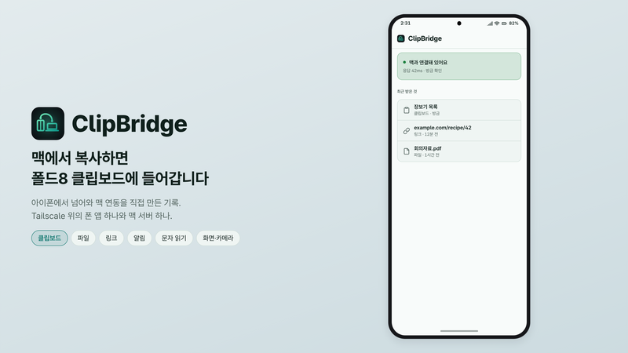</a><br>
<b><a href="https://github.com/joonlab/clipbridge">ClipBridge</a></b> <sub>· 2026-09-20 시작</sub><br>
폰 앱 하나와 맥 서버 하나로 클립보드·파일·링크·알림·문자를 잇습니다. 맥→폰 클립보드는 복사만 하면 자동입니다.<br>
<sub>An Android app and a macOS server that bridge clipboard, files, links, notifications and SMS over Tailscale.</sub><br>
<sub>동작 확인: Galaxy Z Fold8 (Android 17) · macOS 26</sub>
</td>
<td width="50%" valign="top">
<a href="https://github.com/joonlab/galaxy-ondevice-stt">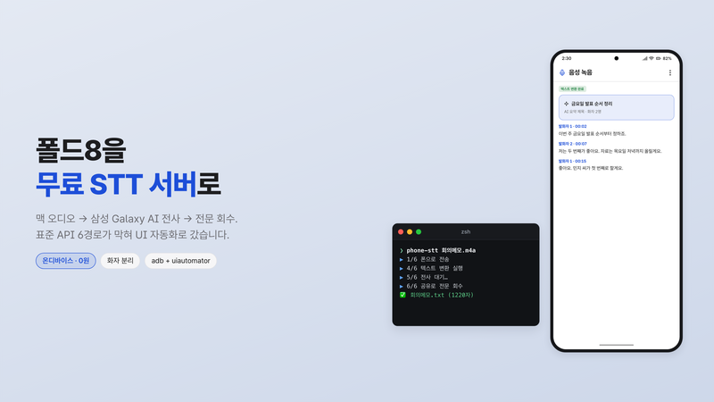</a><br>
<b><a href="https://github.com/joonlab/galaxy-ondevice-stt">galaxy-ondevice-stt</a></b> <sub>· 2026-09-20 시작</sub><br>
맥에서 보낸 오디오를 삼성 음성녹음 앱의 Galaxy AI로 전사하고, 전문을 맥으로 돌려받는 무료 온디바이스 STT입니다.<br>
<sub>Free on-device speech-to-text for a Mac, driving Samsung Voice Recorder&#x27;s Galaxy AI transcription over adb.</sub><br>
<sub>동작 확인: Galaxy Z Fold8 (Android 17) · macOS 26</sub>
</td>
</tr>
<tr>
<td width="50%" valign="top">
<a href="https://github.com/joonlab/foldmic">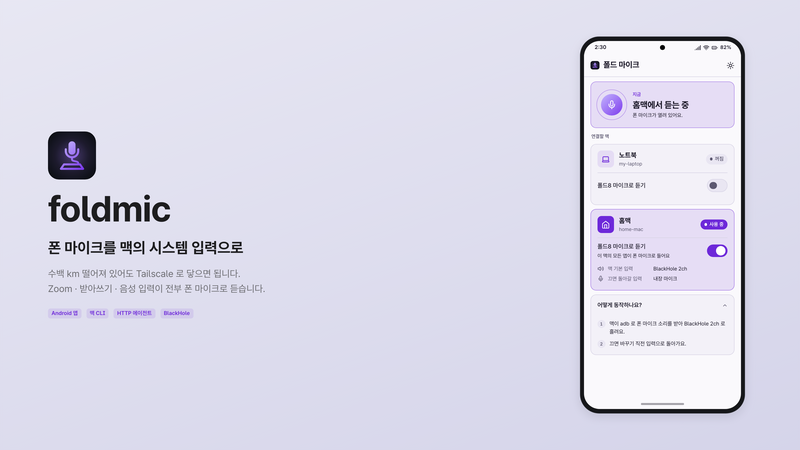</a><br>
<b><a href="https://github.com/joonlab/foldmic">foldmic</a></b> <sub>· 2026-09-26 시작</sub><br>
폰 마이크를 맥의 시스템 기본 입력으로 바꿉니다. 폰과 맥이 멀리 떨어져 있어도 Tailscale로 이어져 있으면 됩니다.<br>
<sub>Turns the phone&#x27;s microphone into the Mac&#x27;s system default input (scrcpy, ffmpeg, BlackHole), switchable from the phone.</sub><br>
<sub>동작 확인: Galaxy Z Fold8 (Android 17) · macOS 26</sub>
</td>
<td width="50%" valign="top"></td>
</tr>
</table>

### 디스플레이 · Display

화면을 서로 빌려 쓰는 것

<table>
<tr>
<td width="50%" valign="top">
<a href="https://github.com/joonlab/fold-cyberdeck">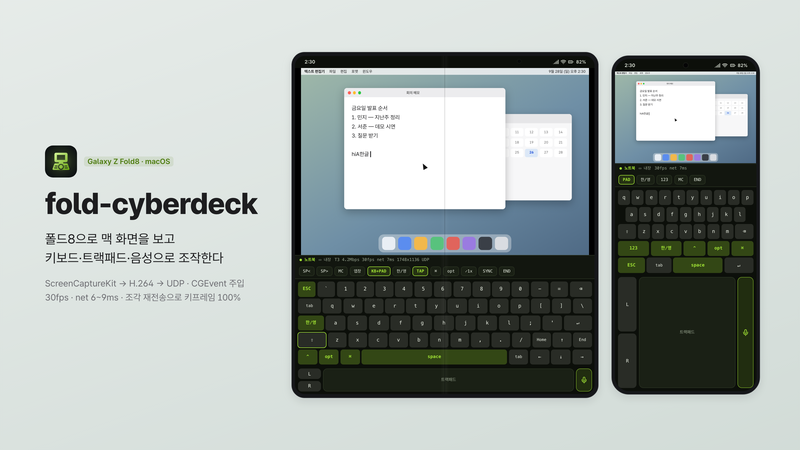</a><br>
<b><a href="https://github.com/joonlab/fold-cyberdeck">fold-cyberdeck</a></b> <sub>· 2026-09-21 시작</sub><br>
맥 본 화면을 폴드8에서 실시간으로 보고 키보드·트랙패드·음성으로 조작하는 사이버덱입니다.<br>
<sub>View the Mac&#x27;s real desktop on the Fold8 and drive it with keyboard, trackpad gestures and voice (ScreenCaptureKit → H.264 → UDP).</sub><br>
<sub>동작 확인: Galaxy Z Fold8 (Android 17) · macOS 26</sub>
</td>
<td width="50%" valign="top">
<a href="https://github.com/joonlab/deskpad-fold">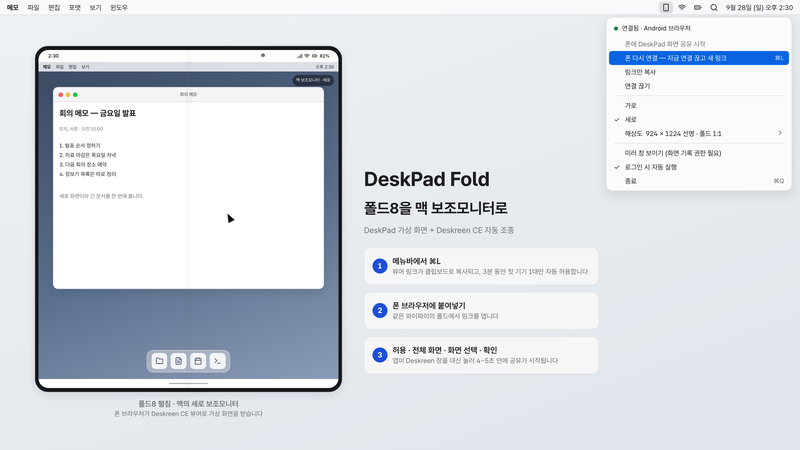</a><br>
<b><a href="https://github.com/joonlab/deskpad-fold">DeskPad Fold</a></b> <sub>· 2026-09-28 시작</sub><br>
폴드8을 맥 보조모니터로 쓰는 DeskPad 포크입니다. 메뉴바에서 폰 연결·가로/세로·해상도를 고릅니다.<br>
<sub>A DeskPad fork that turns the Fold8 into a secondary Mac display, with connect, rotation and resolution in the menu bar.</sub><br>
<sub>동작 확인: Galaxy Z Fold8 (Android 17) · macOS 26 · Deskreen CE 3.2.16</sub>
</td>
</tr>
</table>

### 에이전트 · Agents

폰에서 AI 에이전트를 부리거나 지켜보는 것

<table>
<tr>
<td width="50%" valign="top">
<a href="https://github.com/joonlab/fold-agent">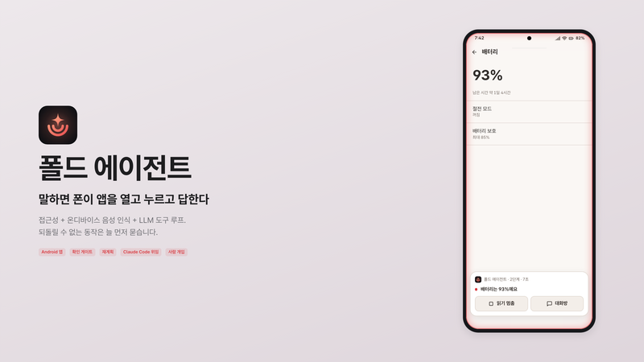</a><br>
<b><a href="https://github.com/joonlab/fold-agent">폴드 에이전트</a></b> <sub>· 2026-09-26 시작</sub><br>
말로 시키면 폰이 스스로 앱을 열고 누르고 답하는 안드로이드 에이전트입니다. 확인 게이트·재계획·사람 개입이 붙어 있습니다.<br>
<sub>A Claude Code–style agent on the phone: accessibility, on-device speech and an LLM tool loop with confirm gates, re-planning and human takeover.</sub><br>
<sub>동작 확인: Galaxy Z Fold8 (Android 17) · macOS 26</sub>
</td>
<td width="50%" valign="top">
<a href="https://github.com/joonlab/cmux-mobile-remote">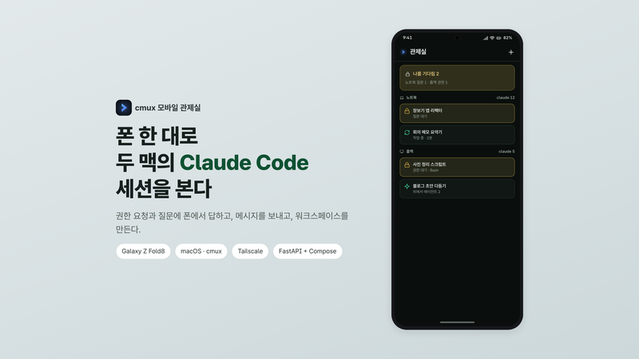</a><br>
<b><a href="https://github.com/joonlab/cmux-mobile-remote">cmux 모바일 관제실</a></b> <sub>· 2026-09-25 시작</sub><br>
폰에서 두 맥의 cmux(Claude Code 세션 수십 개)를 보고, 권한 요청·질문에 답하고, 메시지를 보냅니다.<br>
<sub>See every Claude Code session in cmux on two Macs from the phone, answer permission prompts and questions, and send input.</sub><br>
<sub>동작 확인: Galaxy Z Fold8 (Android 17) · macOS 26</sub>
</td>
</tr>
<tr>
<td width="50%" valign="top">
<a href="https://github.com/joonlab/fold-claude-history">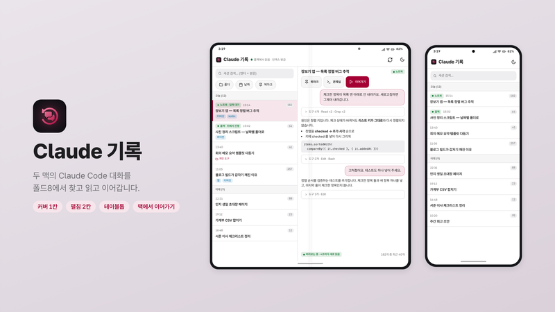</a><br>
<b><a href="https://github.com/joonlab/fold-claude-history">Claude 기록</a></b> <sub>· 2026-09-25 시작</sub><br>
두 맥에 쌓인 Claude Code 대화 기록을 폴드8에서 찾고 읽고, 고른 세션을 맥에서 이어가게 합니다.<br>
<sub>A posture-aware Fold8 viewer for Claude Code history on two Macs that can resume a session on a Mac.</sub><br>
<sub>동작 확인: Galaxy Z Fold8 (Android 17) · macOS 26</sub>
</td>
<td width="50%" valign="top"></td>
</tr>
</table>

### 개발도구 · Dev tools

이 랩의 앱을 만드는 데 쓴 도구

<table>
<tr>
<td width="50%" valign="top">
<a href="https://github.com/joonlab/android-cli-app-skill">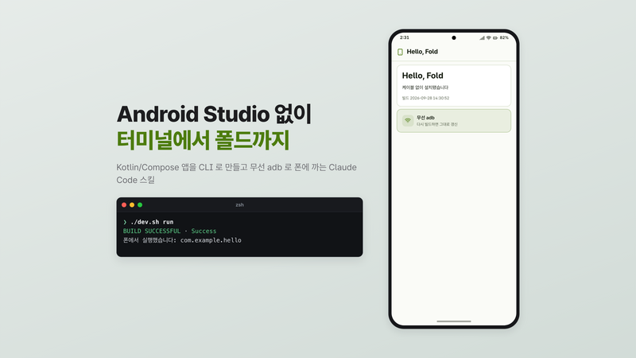</a><br>
<b><a href="https://github.com/joonlab/android-cli-app-skill">android-cli-app-skill</a></b> <sub>· 2026-09-22 시작</sub><br>
Android Studio 없이 터미널만으로 Kotlin/Compose 앱을 만들어 무선 adb로 폰에 설치하는 Claude Code 스킬입니다.<br>
<sub>A Claude Code skill that scaffolds, builds and wirelessly installs Kotlin/Compose Android apps from the CLI.</sub><br>
<sub>동작 확인: Galaxy Z Fold8 (Android 17) · macOS 26</sub>
</td>
<td width="50%" valign="top"></td>
</tr>
</table>

### 생활 · Everyday

맥과 상관없이 폰에서 쓰는 앱

<table>
<tr>
<td width="50%" valign="top">
<a href="https://github.com/joonlab/pinback">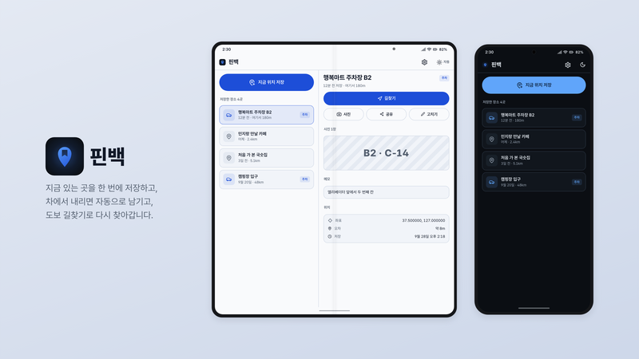</a><br>
<b><a href="https://github.com/joonlab/pinback">핀백</a></b> <sub>· 2026-09-24 시작</sub><br>
지금 있는 곳을 한 번에 저장하고, 차 블루투스가 끊기면 주차 위치를 자동으로 남겨 도보 길찾기로 돌아가게 합니다.<br>
<sub>Save your spot with one tap, auto-save parking when the car&#x27;s Bluetooth disconnects, and walk back via Naver or Google Maps.</sub><br>
<sub>동작 확인: Galaxy Z Fold8 (Android 17) · macOS 26</sub>
</td>
<td width="50%" valign="top"></td>
</tr>
</table>

<!-- PROJECTS:END -->

## 랩 원칙 세 가지

일주일 동안 같은 종류의 실수를 몇 번 하고 나서 정한 규칙입니다.

### 1. 상시 워크플로를 adb 위에 올리지 않는다

adb는 개발·설치·일회성 자동화에만 씁니다. 매일 켜 두고 쓰는 것(클립보드, 파일, 알림, 에이전트)은 폰 앱과 맥 서버가 Tailscale 위에서 HTTP로 직접 주고받게 만들었습니다. 무선 adb는 생각보다 자주 끊깁니다. 공용 와이파이의 기기 격리에서는 페어링이 안 됐고, 핫스팟에서는 무선 디버깅이 켜지지 않았고, 폰을 재부팅하면 `adb tcpip 5555` 가 풀립니다. 5555 포트를 늘 열어 두는 것 자체도 보안상 좋지 않습니다. 그래서 ClipBridge에는 adb가 안 될 때 폰 브라우저로 맥 서버에서 APK를 받는 설치 경로도 따로 두었습니다.

예외도 있습니다. galaxy-ondevice-stt와 foldmic은 삼성 앱 조작과 scrcpy 때문에 adb가 꼭 필요합니다. 두 저장소 README에 그 전제와 보안 주의를 적어 두었습니다.

### 2. 조용히 실패하는 API는 라운드트립으로 검증한다

안드로이드와 macOS에는 실패해도 예외를 던지지 않는 곳이 많았습니다. 백그라운드에서 링크를 열면 아무 오류 없이 무시되고(BAL 제한), 평문 HTTP는 설정이 없으면 조용히 막히고, MediaStore는 APK 파일 이름에 `.zip` 을 붙였습니다. 셸 쪽에서도 BSD grep이 `\s` 를 모르는데 `set -e` 와 겹치면 아무 메시지 없이 스크립트가 끝났습니다.

그래서 「보냈다」를 성공으로 치지 않고, 반대편에서 **도착한 것**을 다시 읽어 확인합니다. 클립보드는 폰 쪽에서 되읽고, adb로 탭한 뒤에는 1~3초 기다려 화면을 다시 덤프하고, 배경화면 편집기의 드래그는 캡처를 잘라 가장자리를 눈으로 봅니다. 사이버덱에서 탭이 우클릭으로 바뀌던 버그는 맥 쪽에 듣기 전용 이벤트 탭을 걸어 실제로 무엇이 도착했는지 보고 나서야 잡혔습니다.

### 3. 되는 정도는 방향마다 다르다

같은 기능도 방향에 따라 가능한 범위가 달랐습니다. 안드로이드는 앱이 포커스 없이 클립보드를 **읽는** 것은 막지만 **쓰는** 것은 막지 않습니다. 그래서 맥 → 폰 클립보드는 완전 자동인데 폰 → 맥은 두 번 눌러야 합니다. 링크는 맥 → 폰으로 보낼 때 「다른 앱 위에 표시」 권한이 있어야 바로 열리고, 문자는 읽기와 보내기의 위험이 달라서 보내기에만 확인 절차를 붙였습니다.

그래서 각 저장소 README의 기능 표는 「되는가」가 아니라 **방향별로 어디까지 되는가**를 적습니다. 막힌 방향은 막힌 이유와 우회 방법을 같이 씁니다.

## 공통 인프라

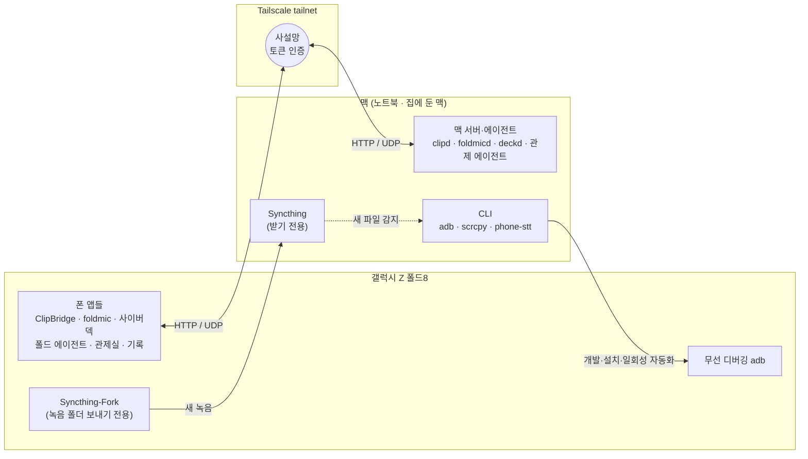

- **Tailscale** — 폰과 맥 두 대를 한 사설망에 묶습니다. 맥 쪽 서버는 Tailscale 인터페이스에만 바인딩하고 공유 토큰을 확인합니다. 같은 와이파이에 있지 않아도, 폰과 맥이 수백 km 떨어져 있어도 같은 주소로 닿습니다. 집 와이파이는 2.4GHz에서 5GHz로 옮겼더니 폰–맥 ping 평균이 17.6ms에서 11.9ms로 줄었습니다.
- **무선 adb** — 처음 한 번 USB로 `adb tcpip 5555` 를 하거나 무선 디버깅 페어링을 합니다. 접속 주소는 mDNS → 핫스팟 게이트웨이 → Tailscale 순서로 찾습니다(ClipBridge의 `lib-device.sh`). 원칙 1대로 개발·설치·일회성 자동화에만 씁니다.
- **Syncthing** — 폰의 Syncthing-Fork가 녹음 폴더를 보내기 전용으로, 맥이 받기 전용으로 동기화합니다. 첫 동기화에서 녹음 약 190개(3.88GB)가 넘어왔습니다. 새 녹음을 감지해 폰이 쉬는 동안 전사하는 대기열(galaxy-ondevice-stt의 `stt-queue`)도 만들었지만, 새 녹음이 실제로 자동 전사된 기록은 아직 확인하지 못했습니다.
- **Claude Code** — 모든 앱은 Android Studio 없이 터미널에서 Gradle로 빌드했습니다. 그 방법을 [android-cli-app-skill](https://github.com/joonlab/android-cli-app-skill)로 정리해 두었습니다.

## 타임라인

9월 20일부터 28일까지 날짜별로 무엇을 만들었는지 적었습니다.

| 날짜 | 만든 것 |
|---|---|
| 9/20 (일) | 「안드로이드는 무선으로 앱을 만들어 바로 깔 수 있다」는 말을 확인하려고 시작했습니다. JDK도 없던 맥에서 CLI 툴체인으로 첫 앱을 빌드해 케이블 없이 설치(약 35분). 무선 adb 경로 문제를 Tailscale로 풀고 **ClipBridge** 첫 판(폰 → 맥 공유 시트, 빠른 설정 타일)을 만들었습니다. Syncthing으로 녹음 동기화, 표준 음성 인식 API가 막힌 것을 확인하고 삼성 음성녹음 앱을 조작하는 **phone-stt**, scrcpy 무선 미러링 런처까지. |
| 9/21 (월) | 폰을 맥 **보조 모니터**로(DeskPad + Deskreen). 클립보드 **쓰기**는 막히지 않는다는 걸 실측해 맥 → 폰 자동 클립보드 완성. 이어서 `file2phone` · `link2phone` · 알림 미러링 · 문자 읽기 · `phone-cam`(폰 카메라를 OBS 가상 카메라로) · 새 녹음 자동 전사 대기열. |
| 9/22 (화) | 전날 밤 시작한 **fold-cyberdeck** 설계를 「맥 터미널 조작기」에서 「맥 화면 픽셀 스트리밍」으로 바꾸고, 맥 서버 deckd(ScreenCaptureKit → H.264 → UDP → CGEvent)와 폰 앱을 새로 만들었습니다. 멀티터치는 계측 테스트로 검증. 반복 노하우를 Claude Code 스킬 두 개(폰 조작, **android-cli-app**)로 굳혔습니다. |
| 9/23 (수) | 사이버덱에 조각 재전송(NACK)을 넣어 키프레임 완주율을 64~92%에서 100%로. 온디바이스 받아쓰기가 먹통이 되는 원인을 찾아 2초 감지 후 망 인식으로 넘기게 했습니다. 루트 없이 adb로 손동작을 흉내 내 **홈 화면 폴더 정리**(커버 6페이지 → 2페이지, 펼침 3페이지 → 1페이지, 지운 앱 0개). |
| 9/24 (목) | 접힘·펼침(가로)·펼침(세로)마다 다른 배경과 충전 중 잠금화면 영상 루틴([팁 문서](docs/tips/oneui-wallpaper-routine.md)). 아이폰 단축어 「주차 위치」가 그리워 차 블루투스가 끊기면 위치를 저장하는 기능을 ClipBridge 안에 붙였습니다(나중의 **핀백**). 사이버덱은 폰이 끊기면 맥 화면 캡처를 멈추도록 고친 뒤 남은 과제를 보류했습니다. |
| 9/25 (금) | **cmux 모바일 관제실**: 폰에서 맥의 Claude Code 권한 요청·질문에 답하기(화면을 파싱하고 키 입력마다 다시 확인하는 폐루프). 같은 날 **Claude 기록** 앱을 설계부터 폴드 자세 대응(테이블톱·책 자세, 힌지 각도 센서)과 「맥에서 이어가기」까지. |
| 9/26 (토) | **foldmic**: 원격 폰 마이크로 받아쓰기를 시험하다가 폰 마이크를 맥 기본 입력으로 바꾸는 도구와 앱으로. **폴드 에이전트** 첫 판: 접근성 + 음성 인식 + LLM 도구 루프, 위험 동작 확인 게이트, 스크린샷·손전등·밝기·방해금지·삼성 노트 쓰기 같은 폰 도구. |
| 9/27 (일) | 7개 앱의 **아이콘 패밀리와 UI 가이드**를 만들고 ClipBridge와 foldmic 화면을 Compose로 다시 짰습니다([디자인 가이드](docs/design/)). 주차 기능을 **핀백**으로 분리(ClipBridge 권한 16개 → 11개). 폴드 에이전트에 막히면 다시 계획하기, 집에 둔 맥의 스킬 실행과 Claude Code 위임. |
| 9/28 (월) | **DeskPad Fold**: DeskPad에 세로 모드를 넣고 Deskreen CE를 대신 조종해 세로 화질을 바로잡았습니다. 폴드 에이전트에 사람 개입(에이전트가 멈추고 제가 직접 조작한 뒤 이어가기). 공개본 정리와 이 허브. |

## 만든 방식

- 전부 Claude Code로 만들었습니다. 저는 무엇을 만들지, 어디까지 할지, 막혔을 때 어느 길로 갈지를 정했고, 폰을 펼치거나 지문으로 잠금을 푸는 것처럼 손이 필요한 일을 했습니다.
- 앱마다 「분석 → 구현 → 실기 확인 → 만든 쪽과 분리된 리뷰」 순서를 지켰습니다. 실기 확인은 adb로 폰을 직접 조작하고 화면을 덤프해 확인하는 방식입니다.
- 틀린 판단도 여러 번 했습니다. 삼성 음성녹음 앱이 밖에서 넣은 파일을 못 읽는다고 결론 냈다가, 화면의 탭을 잘못 본 것이어서 되돌렸습니다. 반대로 KDE Connect식 우회(로그 읽기 + 오버레이)면 폰 → 맥 클립보드도 자동이 될 거라 보고 시도했지만, Android 17 로그에서 막힌 게 확인돼 타일 방식으로 바꿨습니다. 각 저장소 README의 「알려진 한계」에는 이렇게 실제로 확인한 것만 적었습니다.

## 문서

- [폴드 패밀리 디자인 가이드](docs/design/README.md) — 색 역할 10개 + 의미색 3개, 타이포, 간격, 컴포넌트, 폴드 자세 대응
- [One UI 배경·충전 루틴 팁](docs/tips/oneui-wallpaper-routine.md) — 접힘/펼침/회전마다 다른 배경, 충전 중 잠금화면 영상

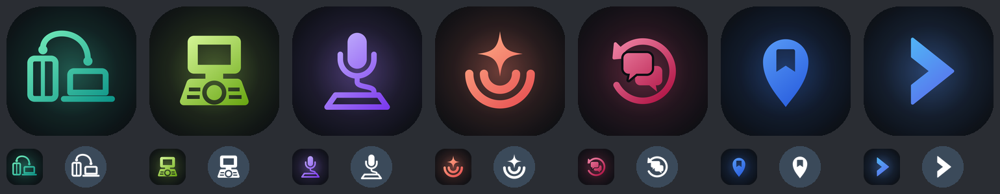

## 새 프로젝트 추가하기

1. 새 저장소에 `docs/images/thumbnail.png`(1600 x 900 캔버스, 설명용 목업)를 둡니다.
2. `projects.json` 의 `projects` 배열에 한 항목을 넣습니다. 분류는 `연동` · `디스플레이` · `에이전트` · `개발도구` · `생활` 중 하나입니다.
   ```json
   { "name": "new-app", "title": "새 앱", "repo": "https://github.com/joonlab/new-app", "category": "생활",
     "ko": "한 줄 설명", "en": "One-line summary.", "status": "동작 확인: Galaxy Z Fold8 (Android 17) · macOS 26",
     "started": "2026-10-01", "thumb": "docs/images/projects/new-app.png" }
   ```
3. 썸네일을 받아 오고 README를 다시 만듭니다.
   ```bash
   python3 scripts/build_readme.py --sync-thumbs <저장소들이 있는 폴더>   # 썸네일 복사 + README 갱신
   python3 scripts/build_readme.py --check                              # 최신인지 확인만
   ```

## 관련 프로젝트

허브: https://github.com/joonlab/android-mac-lab (이 저장소)

## 라이선스

[MIT](LICENSE). 각 프로젝트의 라이선스는 해당 저장소를 따릅니다. 앱 목업에 쓴 Pretendard 글꼴은 SIL OFL 1.1입니다.
