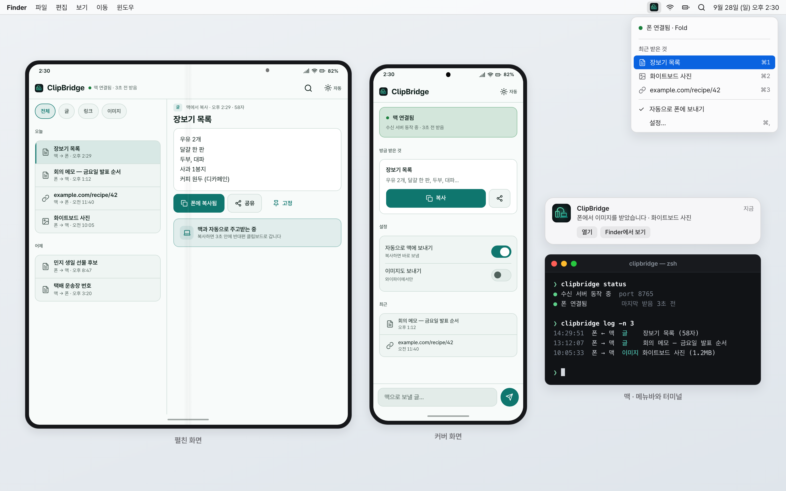

# 목업 킷 — 폴드8 · 맥 화면을 HTML 로 그리고 PNG 로 렌더

README 에 넣을 화면을 실제 캡처 대신 코드로 그리려고 만든 공용 킷입니다.

> **English** — A tiny HTML/CSS kit for drawing Galaxy Z Fold8 (cover / unfolded) and macOS screens as mockups.
> Tokens follow the JoonLab fold-app family guide (10 color roles + 3 semantic colors, light/dark, per-app accent).
> `shot.mjs` renders one or many mockup HTML files to PNG with Playwright.


화면은 설명용 목업입니다.

## 파일

| 파일 | 내용 |
|---|---|
| `kit.css` | 토큰(라이트/다크, 앱별 accent), Pretendard, 기기 프레임, 안드로이드·맥 부품 |
| `kit.js` | lucide 스타일 인라인 SVG 아이콘, 앱 아이콘 경로, 빈 상태바 채우기, 렌더 준비 신호 |
| `shot.mjs` | HTML → PNG (Playwright Chromium) |
| `icons/*.png` | 앱 아이콘 완성본 512px — `cchistory clipbridge cmux cyberdeck foldagent foldmic pinback place`(place = pinback 같은 그림) |
| `fonts/PretendardVariable.woff2` | Pretendard 가변 글꼴 (SIL OFL 1.1) |
| `example.html` / `example.png` / `example-dark.png` | 16:10 구성 예시 (펼침 + 커버 + 맥) |
| `catalog.html` / `catalog.png` | 퀵설정·알림·공유 시트·오버레이·맥 창·터미널 부품 모음 |

## 가장 짧은 목업

```html
<!doctype html>
<html lang="ko"><head><meta charset="utf-8">
<meta name="shot" content="w=1600,h=1000,scale=2">
<link rel="stylesheet" href="https://mockup-kit.invalid/kit.css">
<script src="https://mockup-kit.invalid/kit.js"></script>
</head><body>
<div class="canvas app-clipbridge">
  <div class="stage">
    <div class="fold-cover" style="--zoom:.78">
      <div class="screen">
        <div class="status-bar"></div>
        <div class="app-bar"><span class="title">ClipBridge</span></div>
        <div class="content"><div class="card"><div class="card-title">장보기 목록</div></div></div>
        <div class="nav-handle"></div>
      </div>
    </div>
  </div>
</div>
</body></html>
```

`https://mockup-kit.invalid/` 는 가짜 주소입니다. `shot.mjs` 가 이 주소를 킷 폴더로 연결하므로, 목업 HTML 을 어느 저장소의 `docs/mockups/` 에 두어도 로컬 절대경로가 소스에 남지 않습니다. 대신 브라우저로 HTML 을 직접 열면 스타일이 안 붙습니다 — 확인은 PNG 로 합니다.

## 렌더

```bash
KIT=~/Desktop/10_프로젝트/날짜별/2026/20260928_추커톤_폴드8-안드로이드랩/mockup-kit
node $KIT/shot.mjs docs/mockups/main.html docs/images/main.png            # 기본 1600x1000 @2x
node $KIT/shot.mjs docs/mockups/thumb.html docs/images/thumb.png --h 900  # 썸네일
node $KIT/shot.mjs docs/mockups/main.html docs/images/main-dark.png --dark
node $KIT/shot.mjs --batch docs/mockups                                   # → docs/images/*.png
node $KIT/shot.mjs --batch some/dir --out other/dir --scale 1
```

- 크기 우선순위: 명령줄 `--w --h --scale --dark` > HTML 의 `<meta name="shot" content="w=1600,h=900,scale=2,dark">` > 기본값(1600x1000, 2배).
- `--batch <dir>`: `dir/*.html` 전부. 출력 폴더는 `--out` 이 없으면 dir 이름이 `mockups` 일 때 옆의 `images/`, 아니면 dir 자신.
- `--dark`: `<html>` 에 `.dark` 를 붙이고 `prefers-color-scheme: dark` 로 렌더.
- 렌더가 끝나면 두 가지를 경고합니다. **[잘림]** 문서가 캔버스보다 크거나, 화면·카드·창·터미널 안의 내용이 상자를 넘치면(overflow 로 가려져 눈에 안 띄는 잘림). **[공개 점검]** 소스에 `/Users/…` 경로, Tailscale·LAN IP, `*.ts.net`, 이메일, 전화번호, API 키 모양 문자열이 있으면(종료 코드 3).
- Playwright 는 전역 설치본을 씁니다(`import` 실패 시 `npm root -g` 경로로 불러옴).

## 캔버스 크기

| 용도 | 크기 | 클래스 |
|---|---|---|
| README 본문 이미지 | **1600 x 1000** | `.canvas` |
| 썸네일·소셜 카드 | **1600 x 900** | `.canvas.thumb` + `--h 900` 또는 meta `h=900` |

- 바탕: `.canvas`(은은한 회색 그라데이션) · `.canvas.flat`(단색) · `.canvas.desk-accent`(앱 accent 를 5~9% 섞은 바탕).
- 배치: `.stage`(가운데 정렬 flex, gap 40) · `.stage.top` · `.device-label`(기기 아래 설명) · `.canvas-title` / `.canvas-sub`.
- 기기 크기는 `style="--zoom:.78"`. 커버와 펼침에 **같은 zoom** 을 주면 실제 크기 비례(같은 높이)가 맞습니다. 1600x1000 에 펼침 + 커버 + 맥 창을 나란히 두면 .74~.8 이 맞습니다.

## 클래스

### 테마·앱
- `.dark` / `.light` (또는 `data-theme`) — 아무 가지에 붙여도 그 아래만 뒤집힙니다. 한 캔버스에 라이트 폰과 다크 폰을 같이 둘 수 있습니다.
- 앱 토큰: `.app-clipbridge`(틸) `.app-foldmic`(바이올렛) `.app-foldagent`(코랄) `.app-cchistory`(로즈) `.app-cmux`(초록) `.app-pinback`/`.app-place`(블루) `.app-cyberdeck`(라임, 가이드에 없어 같은 문법으로 유도) `.app-neutral`(기본).
- 토큰 변수: `--bg --panel --panel2 --raised --border --text --dim --accent --accent-tint --on-accent --ok --warn --warn-text --danger`. 화면 안에서 색을 직접 쓰지 말고 이 변수만 씁니다.

### 기기 프레임
- `.fold-cover > .screen` — 커버 480 x 758dp(0.63:1, 실기 1248x1972px), 둥근 모서리, 가운데 카메라 홀. ⚠️ 폴드8 커버는 책처럼 넓다 — 옛 폴드의 길쭉한 1:2.35 가 아니다.
- `.fold-open > .screen` — 펼침 940 x 710dp(1.32:1 **가로**, 실기 2448x1848px), 가운데 세로 접힘선, 오른쪽 위 카메라. 세로로 들면 `.fold-open.portrait`(710 x 940, 접힘선 가로).
- `.no-crease` `.no-hole` 로 접힘선·카메라 홀 끄기.
- 화면 안은 **1px = 1dp** 로 씁니다(거터 16, 머리줄 56, 본문 14.5).
- 화면 안 뼈대: `.status-bar`(비워두면 시각·신호·배터리 자동, `data-time="2:30" data-batt="82"`) → `.app-bar` → `.content` 또는 `.two-pane`(`.pane` 두 개, `.list-detail` 은 360 + 나머지) → `.input-bar` → `.nav-handle`.

### 안드로이드 부품
| 부품 | 클래스 |
|---|---|
| 머리줄 56dp | `.app-bar` > `.mark`(img 또는 아이콘) `.title` `.status`(`.dot.ok` + 글) `.spacer` `.icon-btn` `.theme-btn`(아이콘 + `<span>자동</span>`) |
| 카드 | `.card` (`.dense` `.raised` `.selected` `.tint` `.ok` `.warn` `.danger`), 안에 `.card-row` `.ico` `.card-title` `.meta` `.stat` |
| 목록 | `.list` > `.list-row`(`.selected` = 물듦 + 왼쪽 3dp 띠), `.avatar` |
| 칩·세그먼트 | `.chips` > `.chip`(`.on` 선택, `.filled` 켜짐) · `.seg` > `span.on` |
| 토글 | `.toggle-row` > `.label-main` `.caption` + `.switch`(`.on`) |
| 버튼 | `.btn` `.btn-primary` `.btn-ghost` `.btn-danger` `.btn-block` `.pill` |
| 하단 입력줄 | `.input-bar` > `.input`(`.placeholder`) + `.send-btn`(`.off`) |
| 대화 | `.msg` / `.msg.me` |
| 퀵설정 | `.qs-panel` > `.qs-grid` > `.qs-tile`(`.on`) > `.qs-ico` `.qs-name` `.qs-sub` · `.qs-round` · `.qs-slider`(`--v:60%`) |
| 알림 | `.notif-stack` > `.notif`(`.heads-up`) > `.notif-head` `.notif-title` `.notif-body` `.notif-actions` |
| 공유 시트 | `.scrim` + `.share-sheet` > `.sheet-handle` `.sheet-title` `.share-preview` `.share-targets` > `.share-target`(`.pinned`) |
| 오버레이 | `.overlay-panel` · `.overlay-bubble`(위치는 style 로), 뒤에 깔린 다른 앱은 `.dim-app` |
| 기타 | `.snackbar` `.tag`(`.accent .ok .warn .danger`) `.dot` `.divider` `.mono` `.app-icon`(`.sm .md .lg`) |
| 글자 | `.t-app` `.t-sheet` `.t-hero` `.card-title` `.section-head` `.section-label` `.body` `.label` `.meta` `.caption` `.tnum` |

### 맥 부품
| 부품 | 클래스 |
|---|---|
| 창 | `.mac-window` > `.mac-titlebar`(`.traffic` > `<i></i>`×3, `.mac-title`, `.tb-right`) + `.mac-body` 또는 `.mac-split` > `.mac-sidebar`(`.sb-head` `.sb-item.on`) |
| 메뉴바 | `.mac-menubar` > `.app-name` + 메뉴 글자 + `.extras` > `.extra`(`.active`) `.clock`. `.canvas` 바로 아래에 두면 맨 위에 붙습니다 |
| 드롭다운 | `.mac-menu` > `.m-status` `.m-head` `.m-item`(`.hl` 강조, `.off`, 안에 `.kbd` `.check`) `.m-sep` — 위치는 style 로 (`position:absolute; top:34px; right:16px`) |
| 알림센터 배너 | `.mac-notification` > `img` + `.n-top`(`.n-title` `.n-time`) `.n-body` `.n-actions` |
| 터미널(항상 다크) | `.terminal` > `.terminal-bar`(`.traffic` `.t-title`) + `.terminal-body`(`.t-prompt .t-path .t-dim .t-accent .t-ok .t-warn .t-err .t-b .t-cursor`) |

### 아이콘 (kit.js)
- `<i data-icon="wifi"></i>` → 24 격자, 선 2, 둥근 끝 SVG. 크기는 글자 크기(`font-size`)를 따릅니다.
- 이름: `check x chevron-right chevron-left chevron-down chevron-up arrow-up arrow-left arrow-right plus search settings sliders bell send mic mic-off clipboard copy wifi battery signal bluetooth laptop smartphone monitor link image file file-text folder share map-pin terminal sun moon more-vertical more-horizontal play pause stop download upload refresh keyboard sparkle message command lock clock home volume info alert circle-check pencil paperclip trash pin list-checks calendar zap cast flashlight rotate`
- 앱 아이콘: `` → `icons/foldmic.png`.
- 스크립트에서: `Kit.icon('send', {size: 20, stroke: 2})`, `Kit.appIcon('clipbridge')`.
- 유니코드 글리프(✓ ▸ ⚠)나 이모지로 아이콘을 대신하지 않습니다. 맥 메뉴의 체크 표시(`.check`)와 단축키 기호(⌘)는 예외입니다.

## 목업 데이터 규칙

- **가상 데이터만 씁니다.** 「장보기 목록」「회의 메모」「화이트보드 사진」, 가상 인물 「민지」「서준」, 주소는 `example.com` 처럼.
- 쓰면 안 되는 것: 실제 프로젝트명·고객사 이름, 이메일, 전화번호, IP(Tailscale `100.x`, LAN), `*.ts.net` 호스트, 실제 기기명·시리얼, 세션 이름, `/Users/…` 경로, 실제 연락처·일정·설치 앱 목록.
- 실제 화면 캡처(기존 스크린샷, adb screencap)는 넣지 않습니다. 기존 캡처는 생김새를 참고할 때만 봅니다.
- 목업 소스는 공개본의 `docs/mockups/*.html`, PNG 는 `docs/images/*.png` 에 둡니다.
- README 에 이미지를 넣을 때는 바로 아래에 캡션 한 줄: 「화면은 설명용 목업입니다」.
- 스타일: 평평한 면 + 1px 테두리, 그림자는 떠 있는 것(기기·창·팝업)에만 약하게. 네온·글로우 금지. 바탕은 은은한 단색이나 부드러운 그라데이션.

## 점검 목록 (렌더 뒤)

1. `shot.mjs` 출력에 `[잘림]` `[공개 점검]` 경고가 없는지.
2. PNG 를 열어 글자가 기기 밖으로 넘치거나 겹치지 않는지, 말줄임(…)이 의도한 곳에만 있는지.
3. 라이트·다크 둘 다 필요한 화면이면 `--dark` 로 한 장 더.
